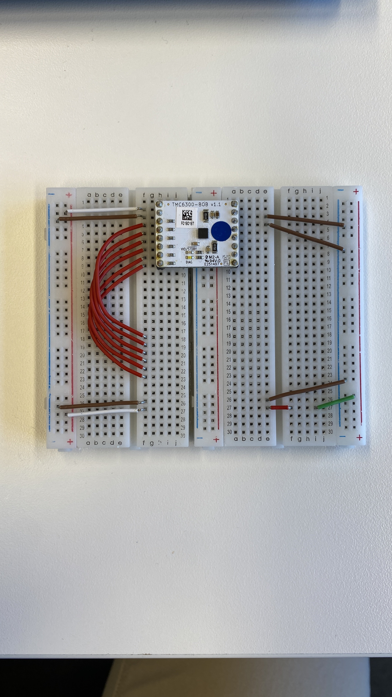
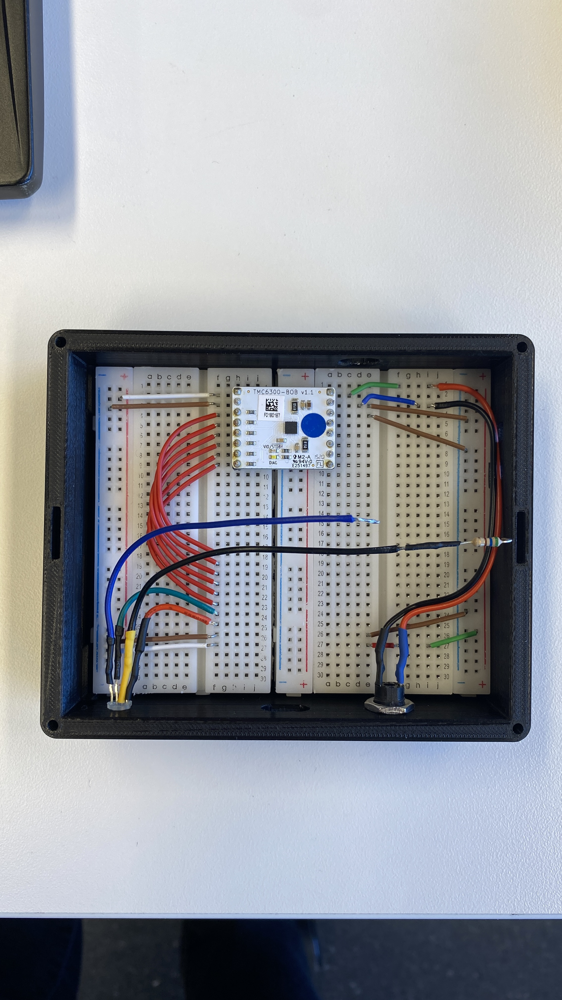
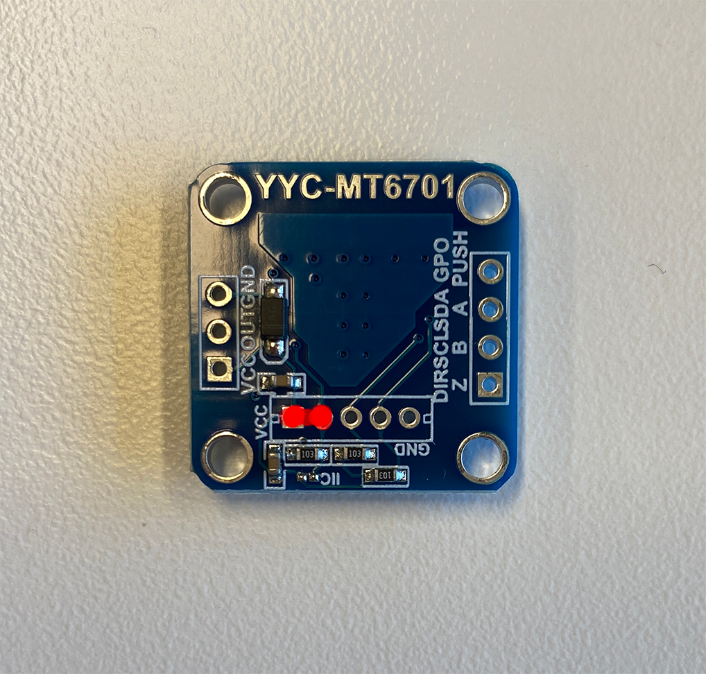
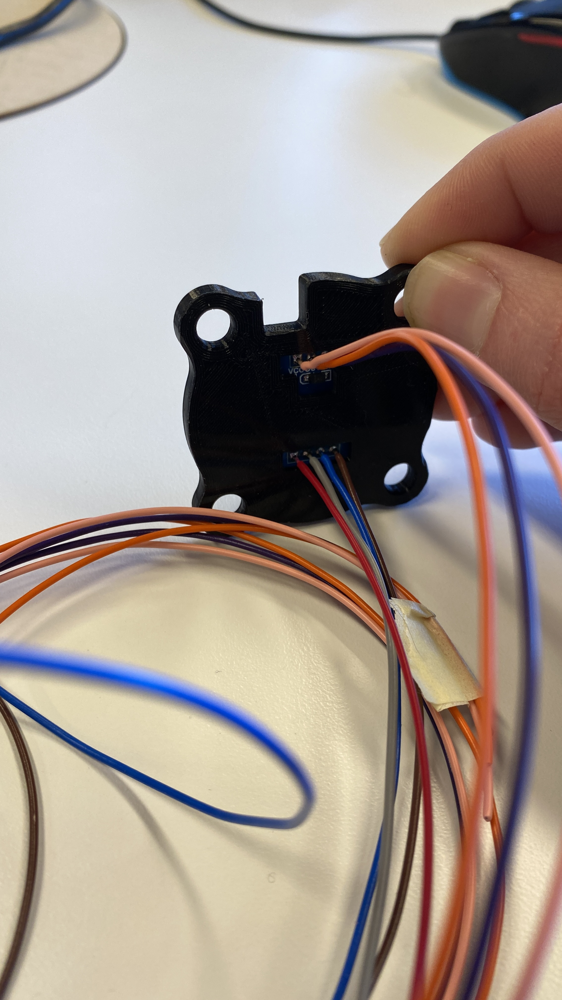
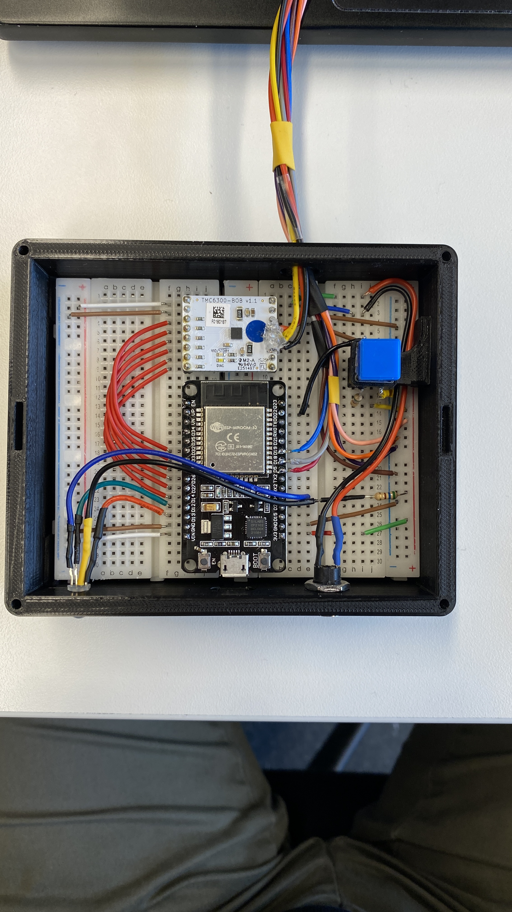
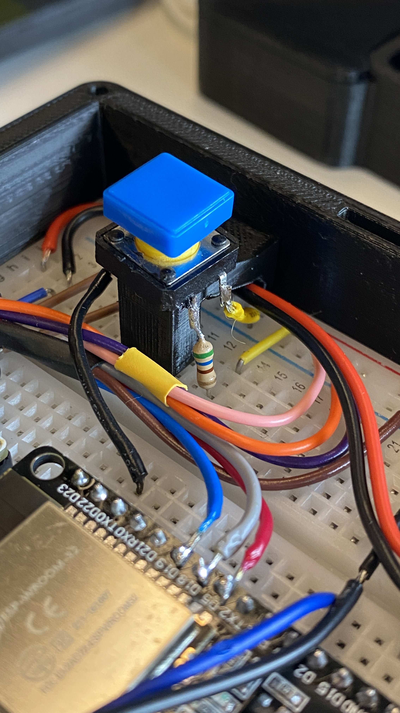

# Electronics Assembly
As the title suggests, the following is a step-by-step guide (with pictures!) for assembling the electronic components of the Fidget Knob project. Enjoy!

First, we’ll build the basis of the electronics box.
## Electronics Box

1.  Begin with the FK_ElectronicsBox 3D printed part.

2.  Take one of the two breadboards and remove the right-hand power rail unit from the board (2 columns of holes)\
&emsp;a. This board becomes the leftmost board in the assembly.

3.  Add the other breadboard to the right half of the box.

4.  Place the TMC6300 BOB 1 row from the top, with the right-side pins in the first column (A) of the right-side breadboard,

5.  Add the brown wires as demonstrated in the image below. All brown wires run to the blue ‘GROUND’ power columns.

6.  Add the white and green/red combo wires (same image). These run from the VCC rails.\
&emsp;a. Important note: later, one rail (right) will be powered by 3.3V and the other (left) 5v. Do not bridge these rails.

7.  Now we place the red wires for the microcontroller to TMC motor driver board.\
&emsp;a. Starting with the lowest down wire, we place one end in F23 and the other in F9.\
&emsp;b. We continue with the next wire up, connecting F22 to F8.\
&emsp;c. Connect the remaining 4 red wires in similar sequence.\
&emsp;d. Do your best to arrange the jumper wires neatly and flatten their overlapping points a bit to avoid vertical forces on the jumper wires themselves.

8.  Prepare the DC power supply jack with ~9cm length, 22AWG wire in red and black.\
&emsp;a. Secure it to the electronics housing and connect positive and ground wires to breadboard I1 and I3, respectively.
9.  Prepare the 4-pin RGB with associated wires and a 560 ohm resistor (Resistor 1) (see picture 2).\
&emsp;a. Some RGB LEDs are common anode, others are common cathode. This will change your pinout and resistor setup. Please modify as you need!\
&emsp;b. Connect up the RED pin to F25 and GREEN to F24, and leave the positive line and BLUE wire unconnected.

 

10.  Place the DoIt DevKit v1 ESP32 development board into both of the breadboards, with the top left EN pin in slot H13 and the 3v3 pin in B27.\
&emsp;a. Please test the board in advance with a simple blink example program in the Arduino examples (and check solder connections to pins!)\
&emsp;b. The USB port should be aligned to the opening on the front of the case. Check this now!

11.  Plug in the BLUE and positive voltage lines from the LED into D23 and the right most power rail, respectively. These will cross over the top of the ESP32 board.

## Fidget Knob Itself

12. **IMPORTANT** The MT6701 magnetic sensor must be enabled in SPI mode. If you purchased the same board as I used, you need to solder a bridge between two pins to select SPI (instead of I2C). See **RED MARKS** in image below.

 
 
13. Solder 7 wires to the magnetic encoder sensor to all available pins on the breakout board. Not all are used for data transmission, but it is smart to ground unused pins to avoid floating and accidental triggering.\
&emsp;a. We used a length of 24AWG wire at approximately 65cm for each, but you can choose to shorten this if desired. Anything above 1 meter length risks data packet loss and transmission issues.\
&emsp;b. **Now do step 3 of the Knob Assembly guide**, attaching the MT6701 sensor board to it's 3D printed housing. This involves feeding the wire bundles through the holes in the housing as seen in the image below.\
&emsp;c. I chose to twist these wires into 2 bundles (one for each side of the breakout board) to make sure they could not be overly bent or destroyed, and secured it with heatshrink tubing. This is optional but makes the device cleaner and more robust, and will slightly shorten the effective wire bundle length.

    

14.  Attach the motor wires.\
&emsp;a. If using the exact motor from my BOM, you will have to cut off the micro connector and solder wires directly to the 3 *very thin* wires exiting the motor. Please exercise utmost caution with this step to secure stable connection. Tinning both wires in advance and later heatshrink wrapping is advised.\
&emsp;b. **Now do step 6 of the Knob Assembly Guide** For the motor, this can be done before OR after step 14.c, below, of bundling the wires.\
&emsp;c. Again, we used 24AWG wire at a length of 65cm for each of the three connections. These lines were then twisted into a bundle and secured with bands of heatshrink tubing.
   
 ## COMBINE PARTS ##  
15.  Once all of the wires are prepared, we can unit the knob assembly and the base electronics box together. **IMPORTANT** please feed all of the wires through the passthrough in the back of the electronics box before starting soldering, otherwise you will not be able to build the device correctly.\
&emsp;a. Please see the below image for a clear view of how everything is wired together.

16. The motor wire bundle can be trimmed about 3-5cm shorter than the wire bundles for the magentic sensor, and should be attached to the following pins:\
&emsp;a. RED to breadboard position A5, soldered directly to TMC6300 pin.\
&emsp;b. YELLOW to A6, "	"	"	"\
&emsp;c. BLACK to A7

17. The two wires bundles for the magnetic sensor can then be added to the breadboard and microcontroller, soldering the Z, B, and A wires and adding the rest to the breadboard.\
&emsp;a. *Hint*: to secure a better connection for the wires entering the breadboard, tin the trimmed ends with solder to make them slightly thicker and more resistant to bending.

   

18. We can now add the pushbutton support arm to the casing (FK_ButtonArm), being careful not to pinch the DC power supply wires against the wall. Please use some adhesive to guarantee the support arm does not move out of position.

19. Add connections to the pushbutton as shown in the following image, with a 560 ohm resistor from the +3v3 volt rail, a black wire to ground, and colored one to breadboard position D14.\
&emsp;a. After securing these appropriate length connections, place the lid (FK_ElectronicsLid) on the box, align the pushbutton on it's support structure, and secure the button underneath with adhesive.\
&emsp;b. Remove the lid.

   

20. Time to double check your work. Use the table and reference image below to compare your own device!

21. Time to flash the ESP32 with the calibration code and then the real Fidget Knob program! Happy fidgeting and research.
    
**Overall Connection Table**
| Wire/Connection From Component | ESP Pin                    |
|--------------------------------|----------------------------|
| LED – Red                      | ESP32 pin D13              |
| LED – Green                    | ESP32 pin D12              |
| LED – Blue                     | ESP32 pin D4               |
| LED - +voltage                 | Right Power Rail           |
| DC Supply – Red (+ voltage)    | Breadboard I1              |
| DC Supply – Black (Ground)     | Breadboard I3              |
| Button - Signal                | ESP32 pin D22              |
| Button - +voltage              | Right Power Rail           |
| Button - Ground                | Right Ground Rail          |
| Motor – Red                    | TMC Pin 12 (Phase U) in A5 |
| Motor – Yellow                 | TMC Pin 13 (Phase V) in A6 |
| Motor – Black                  | TMC Pin 14 (Phase W) in A7 |
| MT6701 - VCC                   | Right Power Rail (3.3v)    |
| MT6701 - OUT                   | Ground                     |
| MT6701 - GND                   | Ground                     |
| MT6701 - Z                     | ESP32 pin D5               |
| MT6701 - B                     | ESP32 pin D18              |
| MT6701 - A                     | ESP32 pin D19              |
| MT6701 - Dir                   | Ground                     |

  

> Written with [StackEdit](https://stackedit.io/).
