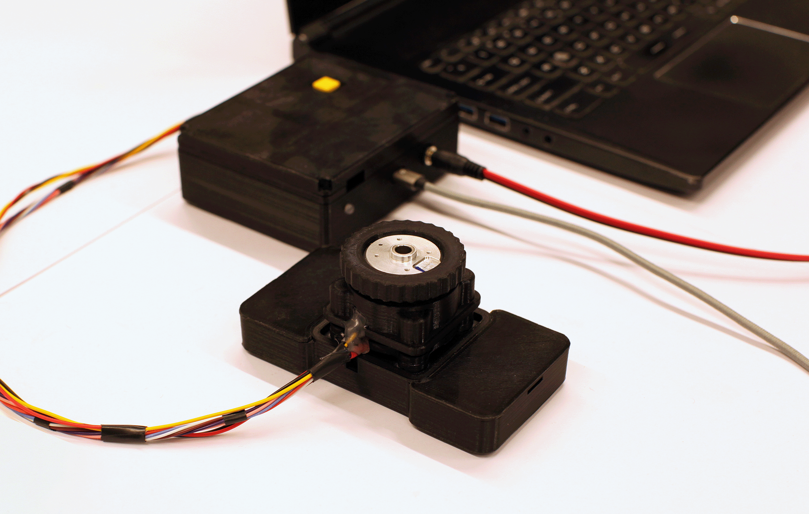

# Fidget Knob

Hello! Thanks for your interest in the Fidget Knob instrumented fidget object and research platform. This README serves as a general guide (or points you to other built-in and external guides) with all you need to know to construct and run your own implementation of the Fidget Knob. As such, I do implore you to read it carefully. 



The overall system is pretty simple: a brushless DC (BLDC) motor has its angular position (and velocity) detected by a magnetic field sensor, which is fed into a ‘field oriented control’ algorithm to generate different haptic sensations and virtual detents. For those experienced in microelectronics, feel free to diverge from this guide when useful. For those still learning, hopefully this guide can take you step by step.

This GitHub repository contains all the files required from both a software and hardware perspective. It contains the following elements, and is organized in GitHub in a similar manner: 

# File Organization
 1. CAD\
&emsp;a. Part Files\
&emsp;b. Knob Assembly Instructions\
&emsp;c. Knob BOM\
&emsp;d. Knob Pics 
 2. Hardware\
&emsp;a. Electronics Assembly Instructions\
&emsp;b. Electronics BOM\
&emsp;c. Electronics Pics
 3. libraries\
&emsp;a. requirements.txt
 4. FidgetKnob_CustomCalibration.ino
 5. FidgetKnob_Main.ino
 6. FidgetKnob_DataLogging.pde
 7. LICENSE
 8. README


# Firmware and Software

The core of this project is a single Arduino .ino file. The software can be initiated in 2 modes: If one holds down the mode select button on startup (until the LED blinks blue 3 times), the Fidget Knob runs independently and without data logging enabled through Processing. If one does not hold any buttons, the Fidget Knob will remain uninitialized until it receives a timestamp from Processing, and it will flash green rapidly to indicate successful boot. While Arduino/C++ may not be the most robust programming language and platform for advanced works, it is relatively approachable for beginner and intermediate coders and thus suits our use case. 

This main .ino is supported by multiple libraries (found in requirements.txt) that are REQUIRED for the proper functioning of the software. These libraries are also included in the 'libraries' folder due to their permissive licensing rules.

**BEFORE RUNNING** the Fidget Knob, one must calibrate it with the included calibration program *CustomSimpleFOCCalibration.ino.* Please note this calibration program is not great, and one should run it multiple times to get an average value for the "electrical offset." This value then needs to be changed in FidgetKnob_Main.ino file. The calibration program also should determine the amount of electrical pole pairs your motor has, but I find it best to do this using instructions on SimpleFOC's page for getting started (https://docs.simplefoc.com/example_from_scratch), or use the manufacturer claim. By setting this as a fixed value in the program, the 'electrical offset' calibration becomes more accurate. One can also use SimpleFOC's built in offset calibration programs, but these seem to yield equally inaccurate results with this specific hardware setup.

Datalogging is handled over serial connection with a parallel Processing scripts (FidgetKnob_DataLogging.pde). One can utilize this script either through the Processing IDE (running on a PC connected to the Fidget Knob via USB) or through the standalone application also included on this GitHub. Please note that certain parameters need to be adjusted (such as data file name and COM port of device) per instance of the Fidget Knob, so we highly recommend the former option of using the IDE. Complete instructions for the code, it's variables, and it's functions are found within the Processing file itself.

## Future Developments
We welcome any iterations that researchers and independent users wish to make for this prototype. We ask that you record these changes in a systematic way for future users.

A clear first point of future development is to enable either local or wireless data logging to untether the device from a laptop. The ESP32 platform is readily equipped to do so, and it was outside the scope of my own research.

The calibration programs are notoroiusly finicky and not fully functional. These need to be improved for this hardware combination to enable better off-the-shelf usage.

*insert more here when discovered*

# CAD
To build a full Fidget Knob, one will require a number of 3D printed parts to make up a housing for the knob and a container for the electronics. All of these files have been provided (as Solidworks .sldprt and print-ready .stl files) in the CAD folder.

While assembly of the parts is pretty straightforward, we have included a step by step instructions (KnobAssembly) and a bill of materials in the relevant folders.

# Potential FAQ and Troubleshooting
To save the general public some hassle, I have compiled a list of the largest and most crucial errors that I encountered while creating this device, as well as their solutions. This document (Troubleshooting.txt) can be a resource if something goes wrong, most specifically with compiling software and building out the electronic components of the project. 

# Acknowledgments

This project is more or less a branch of Scott Bezek’s ‘[SmartKnob](https://github.com/scottbez1/smartknob)’ project , which is itself just a custom implementation of the [SimpleFOC](https://simplefoc.com/) library ([https://github.com/simplefoc](https://github.com/simplefoc)). We are greatly indebted to both of those projects and communities.

This project was developed during my term as a research employee at the faculty of Industrial Design Engineering at the Technical University of Delft in Delft, the Netherlands. As the project is based in open source software, no intellectual property rights are derived by the University.

# License and Citation
This Fidget Knob platform is designed for use in a research setting, ideally to enable better study of fidgeting behaviors and to help create target design interventions in this space. For those who use the Fidget Knob in their research, please cite this project with the following DOI: XXXXXXXXXXX.

This project is licensed under Apache v2 (software, electronics, documentation) and Creative Commons Attribution 4.0 (hardware/mechanical) (see [LICENSE.txt](https://github.com/jeichenlaub/fidgetknob/blob/main/LICENSE)  and  [Creative Commons](https://creativecommons.org/licenses/by/4.0/)).
```
'fidgetknob' Copyright 2023 - John Anders Eichenlaub 

Licensed under the Apache License, Version 2.0 (the "License");
you may not use this file except in compliance with the License.
You may obtain a copy of the License at

		http://www.apache.org/licenses/LICENSE-2.0
		
Unless required by applicable law or agreed to in writing, software
distributed under the License is distributed on an "AS IS" BASIS,
WITHOUT WARRANTIES OR CONDITIONS OF ANY KIND, either express or implied.
See the License for the specific language governing permissions and
limitations under the License.
```


> Written with [StackEdit](https://stackedit.io/).
